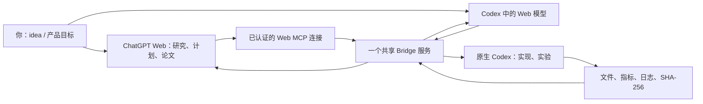

# Engineering Bridge Studio

**你提出 idea，ChatGPT Web 负责研究、规划和写作，原生 Codex 负责执行，Bridge 保存任务和证据。**

[English](README.en.md) · [安装指南](docs/installation.md) · [研究工作流](docs/chatgpt-codex-workflow.md) · [实际验证记录](docs/validation.md) · [上游与许可证](docs/upstreams.md)

这是把 Engineering Bridge 与固定版本的 codex-chatgpt-web 组合起来的开源发行版。首个融合版本为 **2.0.0-beta.1，macOS**。Web 模型通过上游 Launcher 接入 Codex；本插件连接共享的本地 Bridge 服务。浏览器入口和 Codex 入口可以访问同一份工作区、研究 contract、产物和审阅记录。



## 安装

需要 macOS、Node.js 22+、Git、已安装并登录的 Codex CLI。下载本仓库 Release 中的发行包，并按旁边的 `SHA256SUMS` 校验。发行包包含插件、Bridge 运行时及生产依赖，Web Launcher 由统一命令按固定版本和摘要下载安装。

已有 Bridge 用户使用 `connect` 指向原配置；新用户使用 `init` 明确选择项目。具体命令见 [安装指南](docs/installation.md)。从源码开发：

```sh
git clone https://github.com/superorange0707/engineering-bridge-studio.git
cd engineering-bridge-studio
npm ci
npm test
node bin/bridge.mjs --help
```

## 如何分工

| 角色 | 负责的工作 | 交付物 |
| --- | --- | --- |
| 你 | idea、价值判断、研究方向、最终发布决定 | 产品目标与研究问题 |
| ChatGPT Web | 文献研究、假设、实验设计、大纲、写作、结果审阅 | 有依据的计划和研究 contract |
| Bridge | 工作区身份、执行边界、角色路由、持久记录 | 可追踪的 run 与证据链 |
| 原生 Codex | 实现代码、运行基线/实验、记录失败与指标 | 可重放脚本、数据、日志和产物 |

研究计划必须明确假设、基线、数据划分、种子、指标和实验规程。Codex 在独立 run 目录执行，网络关闭，源项目写入权限独立管理。Web 读取真实产物后提交 review；一次执行成功或一个文件哈希都不能证明论文结论成立。可以用 `parent_run_id` 继续下一轮实验。

## 当前能力和边界

- 一个配置对应一个服务所有者；多个 MCP 客户端各有独立会话，共享任务状态。
- 十九个 Bridge 工具，包含工程检查、受控补丁、六个研究/工程 collaboration 工具。
- 持久化 contract、执行结果、声明产物和 review。旧式 `run_task` 的监督状态仍有自己的生命周期，不等同于 collaboration 历史。
- Web 模型适配器固定到 codex-chatgpt-web v5.0.6，校验官方压缩包的 SHA-256，并保留应用包与许可。登录、浏览器 profile、provider route 和远程工具连接由该 Launcher 管理。
- 原生执行器标记其子进程，子进程中的 Bridge 插件拒绝再次委托，避免循环执行。
- `doctor` 只报告本地检查结果；真实 Web→执行→产物→review 是独立验收。项目历史已完成过 Web 发起的三随机种子基线实验及重启读回；融合入口需按安装指南在自己的账户验收。

本发行版不承诺把 ChatGPT Projects、Canvas、Deep Research 等整个产品界面嵌入 Codex。上游 Web 模型入口使用任务绑定的浏览器会话。使用 Web 服务和原生 Codex 分别需要对应账户权限；不会把账户凭据打包给其他用户。

## 来源

Bridge 基线为 [wudy29/engineering-bridge](https://github.com/wudy29/engineering-bridge) v1.2.1；Web 组件为 [miuuyy/codex-chatgpt-web](https://github.com/miuuyy/codex-chatgpt-web) v5.0.6。两者都是 MIT 开源项目。本发行版有自己的版本号和回归测试，不宣称包含 Engineering Bridge 上游 v1.4.4 的全部提交管理或 Windows 功能。精确 commit、组件边界和第三方通知见 [上游记录](docs/upstreams.md)。

贡献代码前请阅读 [CONTRIBUTING.md](CONTRIBUTING.md) 和 [SECURITY.md](SECURITY.md)。请勿在 issue、commit 或 release 中上传 CV、浏览器会话、实验私有数据、runtime key 或个人工作区配置。
