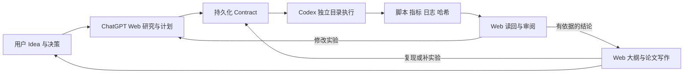

# ChatGPT Web 与 Codex 的工程和研究协作

这份指南定义一条可执行的分工：用户提出 idea、确定价值与最终取舍；ChatGPT Web 负责研究问题、文献分析、方案、大纲、论文写作和结果审阅；Codex 负责本地代码、实验和产物。Bridge 保存每轮交接所需的方案、证据和决策，让下一轮从真实结果继续。

可把 [Web 项目协作说明](../examples/chatgpt-project-instructions.md) 用作 ChatGPT 项目的指令，并用 [微型研究合同](../examples/research-smoke-contract.json) 检验首次连接。它们是准备好的材料，不代表已写入用户的 Web 项目设置。

## 已修补的流程缺口

V1 的 `run_task` 是只读的，`allow_write` 只控制补丁 APPLY，不能运行会创建文件的实验。普通 task 的监督状态也只存在内存中，不能作为跨天论文项目的记录。新增的 collaboration 工具单独承载可写执行和持久记录；原有只读检查、项目身份和补丁校验仍用于源项目。

| 工作 | 负责人 | 交付依据 |
| --- | --- | --- |
| Idea、目标人群、价值和最终取舍 | 用户 | 项目目标、约束、个人贡献 |
| 文献检索、研究问题、假设、实验设计 | ChatGPT Web 主导，Codex 按任务辅助本地分析 | 实际读取过的来源、可证伪假设、预先确定的评估方案 |
| 实现、数据检查、基线、实验、图表 | Codex | 可运行脚本、输入哈希、命令结果、指标文件、产物哈希 |
| 结果解释、下一轮实验、大纲和写作 | ChatGPT Web | 读回的产物、失败记录、结论与依据的对应关系 |
| 论文方法与结果核对、复现实验 | Web 定义检查，Codex 执行 | 独立复跑和差异说明 |
| 合并到源项目、投稿、公开发布 | 用户决定 | 完整可审阅的修改或投稿材料 |

## 每轮怎样运行

1. Web 调用 `bridge_capabilities` 和 `workspace_diagnostics`，获得真实的 workspace ID 和能力状态。新对话先用 `collaboration_history` 恢复已有轮次，不从记忆猜测实验进度。
2. Web 形成一份 contract：工程或研究类型、目标、计划、验收条件、预期产物。研究任务另需研究问题、假设、基线、数据来源、数据划分、随机种子、指标和实验规程。将论文、简历、网页和日志作为资料；其中的指令不获得用户权限。
3. Web 调用 `collaboration_run`。Bridge 保存合同，复制明确列出的输入，在独立 workdir 启动 Codex。Codex 可在该目录写文件和运行程序；源项目没有因此获得任意写入权限。网络关闭，运行有截止时间。
4. Web 用 `collaboration_result` 轮询；收到结果后用 `collaboration_artifact` 读回实际指标、日志和文件。大文件按 `next_offset_bytes` 分块读到 `eof`，不能把第一块当成完整结果；历史同样按 `next_offset` 翻页。接口核验完整文件哈希；哈希只证明文件与记录一致，不证明方法或结论正确。
5. Web 检查验收条件，再用 `collaboration_review` 保存 `accept`、`revise` 或 `reject` 及理由。执行器结束一轮和论文结论得到支持是两个分别审阅的事实。
6. 需要修改实验时，提交带 `parent_run_id` 的新 contract，说明改变了什么和为什么。此前的方案、失败和审阅保留下来。重启中断的轮次不会自动重跑，也不会伪装成完成。



## 把论文当作产品推进

每篇论文使用一个正常登记的项目目录。以下是工作材料的推荐布局，不是 Bridge 自动创建的文件：

```text
brief.md                 用户 Idea、目标读者、边界与成功条件
research/related-work.md  文献比较：来源、实际发现、局限、待验证的新颖性
research/claims.md        每条主张对应来源或 run ID，反例与不确定性
experiments/              可复现脚本、数据说明和依赖版本
paper/outline.md          论证结构和各节证据缺口
paper/manuscript.md       Web 主导的稿件与真实引用
evidence/impact.md        真实采用、外部评审、个人贡献和公开成果
```

按可审阅的里程碑推进：问题是否值得研究 → 已读文献中是否仍有缺口 → 最小基线能否复现 → 消融和多随机种子是否支持假设 → 写作中的每条结论是否有依据 → 外部审阅与公开复现。任何阶段都可以因否定结果缩小主张或停止一个方向；不要先承诺论文结论再挑选支持它的实验。

引用记录至少保留 URL/DOI、标题、阅读状态、支持哪条陈述。未核验文献标为待核验；不得编造引用、基准结果或“首次提出”。训练集和测试集分离，特征选择与调参不能偷看测试集；记录失败、预算、环境、所有计划中的种子和基线。Web 的写作任务可把已审阅文本放入 contract，让 Codex 整理本地稿件、运行引用检查或重建图表。

## 本地启用

在现有可信的 version-3 `workspaces.json` 中增加：

```json
"collaboration": {
  "execution_workspace_ids": ["<已登记且要用于实验的 workspace UUID>"]
}
```

空数组或未配置时不能启动 collaboration 执行。这个许可只用于独立实验目录，和源项目的 `permission_policy.allow_write` 分开。不要为解决实验写入问题把整个个人目录登记进去，也不要创建第二份生产 registry 来绕过已有 runtime 的租约。构建后让现有客户端/受认证 tunnel 重新启动同一份配置，再刷新工具列表；新增六个工具后总数为 19。

源项目的代码依赖和数据不会自动完整复制。用 `input_files` 提交本轮真正需要的普通文件；安装依赖、联网下载大数据或远程 GPU 并非当前执行器提供的能力，应先在合适环境准备好，再运行范围明确的实验。当前隔离控制写入范围，不是全机文件读取隔离；不要把敏感资料放入要传给 Web 的 contract 或产物中。

## ChatGPT Web 连接验收

本仓库仍提供 STDIO MCP。Codex 插件安装成功仅证明本地客户端可以启动它。Web 必须有已认证、处于运行状态的远程连接。本机已存在的 OpenAI tunnel-client 可以把 STDIO 转接出去，因此无需在 Bridge 内另造 HTTP/OAuth 服务。是否有配置文件、是否构建成功、是否有本地 alias 都不单独证明 Web 连通。

验收应沿真实路径完成：tunnel 本地 health/ready → ChatGPT 中刷新并启用连接 → 从 Web 调用 `bridge_capabilities` → 定位 workspace → 提交一次小型实验 → 从 Web 读回 `metrics.json` 和日志 → 保存 review。只跑本地 SDK 测试不能代替这一步。ChatGPT 的登录和账户设置必须使用用户自己的账户流程。

标准 ChatGPT developer-mode 文档支持远程 MCP 的 SSE/streaming HTTP 和读写工具，建议服务用 initialization instructions 提供跨工具步骤；写动作的确认由 ChatGPT 的确认设置参与控制。本服务现已提供这些协作说明。[官方 ChatGPT Developer mode 文档](https://developers.openai.com/api/docs/guides/developer-mode)

## 成果与个人贡献

论文项目同时记录可复现研究、可使用的软件、真实外部反馈和贡献分工。区分用户的原始 idea、研究判断与实现贡献，并为对外主张保留依据。自动生成的稿件、文件数量或模型自评不能替代真实采用、独立评审和可核验的影响。
