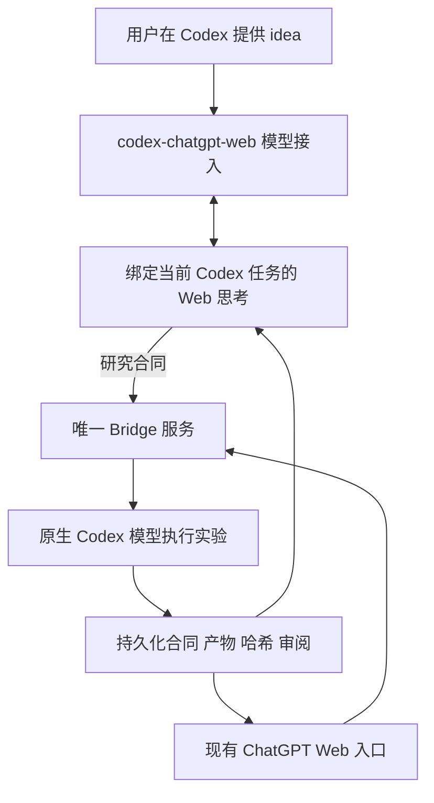

# codex-chatgpt-web 与本项目的衔接

已检查用户指出的 [miuuyy/codex-chatgpt-web](https://github.com/miuuyy/codex-chatgpt-web)，源码版本为 `e85e3693fdb4e3e033348c08df0298c20fcdb612`（2026-09-11 获取）。这次只读取源码，没有执行其安装器、修改 Codex provider 或导入浏览器会话。

它确实提供了“ChatGPT Web 思考、Codex 执行”的另一种实现：Codex 的 Responses 请求经本地代理送入任务绑定的 ChatGPT 页面，Web 的工具调用再通过 MCP 返回同一 Codex 任务。原生 Codex 保留会话、工具、审批与上下文管理。[项目说明](https://github.com/miuuyy/codex-chatgpt-web/blob/e85e3693fdb4e3e033348c08df0298c20fcdb612/README.md)

| 选择 | 日常入口与职责 | 对当前需求的意义 |
| --- | --- | --- |
| Web 主导的 Engineering Bridge | 用户在 ChatGPT Web 研究、讨论与写作；Web 把合同交给独立 Codex 执行器 | 延续用户原有 Web 使用方式，可跨项目保留研究轮次和证据 |
| codex-chatgpt-web full mode | 用户在 Codex 选择 Web 模型，Web 模型通过当前任务的原生工具执行 | 更直接地让 Web 模型成为 Codex 的思考后端；需要该项目的模型路由与浏览器接入 |
| 研究记录层 | 合同、输入、实验脚本、结果、审阅与论文主张的对应关系 | 两种入口都需要；原生聊天记录不能自动证明某个实验或论文结论成立 |

源码中值得采用的工程原则：

- **交接必须绑定身份。** 其 MCP 调用先用 turn capability 取得对应任务的工具环境，限制跨任务串线。我们的独立实验采用稳定 run/workspace/parent 身份，并给公开执行入口增加 `request_id` 幂等重试：同一请求重发返回原轮次，变更实验必须用新 ID。UUID 是幂等标识，不冒充认证凭据。[MCP 实现](https://github.com/miuuyy/codex-chatgpt-web/blob/e85e3693fdb4e3e033348c08df0298c20fcdb612/src/adapters/chatgpt-web/mcp-server.ts)
- **上下文交接与工具权限分开。** 其压缩交接使用单次、受限的 checkpoint，而不是让总结操作继承所有工具。我们的 contract/history/review 保存任务与证据，不镜像完整会话，也不把文献中的指令变成执行许可。[架构与压缩说明](https://github.com/miuuyy/codex-chatgpt-web/blob/e85e3693fdb4e3e033348c08df0298c20fcdb612/docs/architecture.md)
- **健康检查不能等于任务成功。** 本项目新增的检查器分别报告 tunnel health、control-plane polling 和未验证的 Web round trip；验收仍需实际执行并读回产物。
- **跨端等待与取消必须有明确状态。** 上游把工具请求的截止时间和任务终止分开处理。本项目的取消入口最多等待五秒确认请求，持久化 `interrupting`，直到执行器返回终态才记录 `interrupted`；仅收到取消 RPC 的 ACK 不能宣称进程已经停止。重复取消不启动新执行，晚到的产物仍作为部分证据保留。

当前先完成 Web 主导的工程/研究闭环，不重复实现另一个浏览器驱动或 Responses 代理。如果用户选择以 Codex 为主界面，可独立采用该项目作为模型接入层；研究合同和产物审阅流程仍保留。采用前要对照其版本验证现有 Codex 配置、任务上下文、工具权限和退回原配置的路径，不能把“同名模型”当成已经接通。

该项目为第三方实现；README 中关于产品额度或风险的描述不作为本项目的能力保证。当前比较基于读取的实现，没有宣称在用户机器上验证过其完整运行。

## 下一阶段：从 Codex 使用 Web 思考，同时保留 Bridge 研究记录

推荐目标是两个入口共用同一项研究和同一份执行记录。现有 ChatGPT Web 入口已经通过真实执行、产物读回、审阅及重启恢复验收；Codex 内选择 Web 模型这一入口仍待接入与验收。

三个组件分别承担明确职责：上游负责模型路由、浏览器会话和当前 Codex 任务的工具调用；Codex plugin 提供可发现的工具和协作说明；Bridge 管理项目身份、实验合同、隔离执行、产物与审阅。把 plugin 目录复制进仓库不会自动装好模型路由。

上游当前通过 `openai_base_url` 将内置 OpenAI provider 指向本地代理，并只把 `chatgpt-web/*` 模型交给 Web；其他模型请求仍透传原生服务。官方配置文档也把模型连接配置与项目工具分开，相关路由需放在用户配置，不能靠项目 `.codex/config.toml` 覆盖。[官方配置说明](https://learn.chatgpt.com/docs/config-file/config-advanced)

需要先解决并验证的接缝：

1. **只有一个 Bridge 实例拥有持久状态。** 旧的 plugin launcher 会启动另一个持有独占 lease 的 STDIO 服务，与 Web tunnel 冲突。融合版把 STDIO 入口改为连接共享服务的客户端，每个连接使用独立 MCP session；不新建第二份 registry，也不移除状态所有者的租约保护。
2. **思考模型和实验执行模型各自明确。** Web 主控负责方案和审阅；Bridge 的实验子任务继续明确使用原生 Codex 模型。当前 registry 固定 Luna/Terra/Sol，上游也支持原生透传，所以接入代理本身不必然造成递归；仍须用实际 trace 验证模型路由，防止未来配置把执行器再次指回 Web 主控。
3. **普通工具调用与研究轮次区分。** Web 经上游直接调用当前 Codex 的 shell 是一个模型使用工具；经 Bridge 交付合同、由独立执行模型运行并读回审阅，才是本项目要求的两方分工。常规小改动可走原生工具，正式实验需要持久记录。
4. **按能力验证 Web 功能。** 上游使用绑定任务的临时聊天和自己的浏览器会话。模型推理接入不自动导入现有 ChatGPT Projects、资料、Deep Research 或 Canvas；研究材料和论文进度仍用显式合同、来源记录和项目产物恢复。

安装封装可以作为统一入口，但先固定经过审阅的上游版本并保留 MIT 归属，保持模型接入和 Bridge 服务的边界。验收条件：Codex 中选择 Web 模型；由它创建一轮 Bridge 实验；执行 trace 确认为原生模型；两个入口读取相同 run ID、产物和审阅；重启后保持一致；退出接入能恢复原有模型路由。

本节是整合设计，不表示已安装上游启动器或修改当前 Codex 的模型路由。
